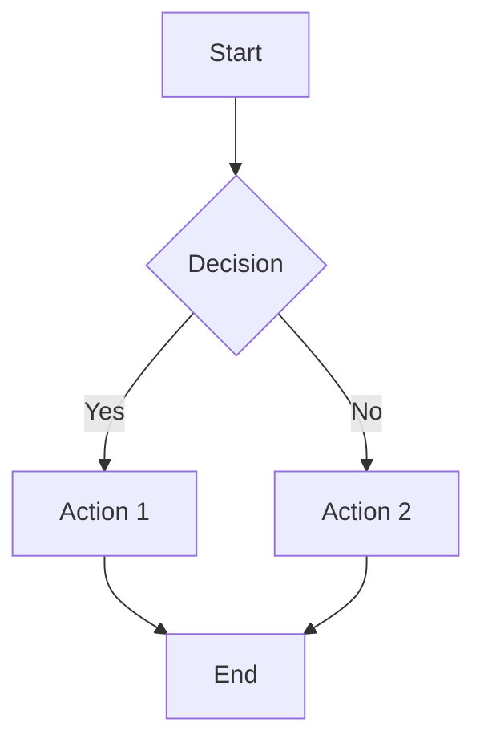
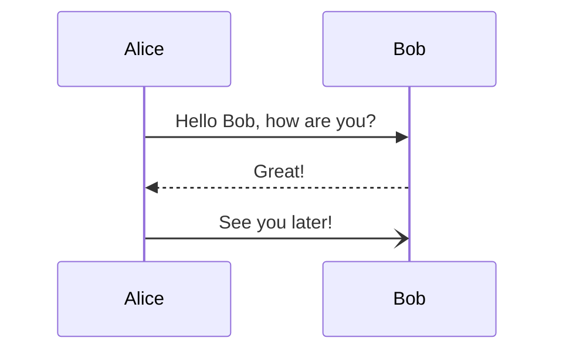

# 🧜‍♀️ MermaidRenderer

An interactive web-based Mermaid.js diagram editor and renderer with native macOS integration.

## ✨ Features

- **Live Editing**: Real-time Mermaid diagram rendering as you type
- **Multiple Diagram Types**: Support for flowcharts, sequence diagrams, class diagrams, Gantt charts, git graphs, and mind maps
- **Example Gallery**: Pre-built examples to get you started quickly
- **Export Options**: Download diagrams as `.mmd` files or export as SVG
- **Zoom Controls**: Interactive zoom in/out with reset functionality
- **File Import**: Load existing Mermaid files from your computer
- **Native macOS App**: Objective-C implementation for desktop integration

## 🚀 Live Demo

🌐 **[Try it live on Vercel](https://mermaid-renderer.vercel.app)**

## 🛠️ Technologies

- **Frontend**: React 18 + Mermaid.js
- **Native**: Objective-C + Cocoa (macOS)
- **Build**: Create React App + Make
- **Deployment**: Vercel + GitHub Pages ready

## 📊 Supported Diagram Types

| Type | Example |
|------|---------|
| **Flowchart** | Decision trees, process flows |
| **Sequence** | API calls, user interactions |
| **Class** | UML class diagrams |
| **Git Graph** | Branch visualization |
| **Gantt** | Project timelines |
| **Mind Map** | Concept visualization |

## 🏃‍♂️ Quick Start

### Web Version
1. Visit the [live demo](https://mermaid-renderer.vercel.app)
2. Choose an example or start typing your own diagram
3. Click \"Render\" to generate the visualization
4. Export as SVG or save as `.mmd` file

### Local Development
```bash
# Clone the repository
git clone https://github.com/claudebuildsapps/MermaidRenderer.git
cd MermaidRenderer

# Install dependencies
npm install

# Start development server
npm start

# Build for production
npm run build
```

### Native macOS App
```bash
# Build the native macOS application
make

# Run the application
./mermaid_renderer
```

## 📝 Example Diagrams

### Flowchart


### Sequence Diagram


## 🎯 Use Cases

- **Software Documentation**: Visualize system architecture and workflows
- **Project Planning**: Create Gantt charts and timelines
- **API Documentation**: Sequence diagrams for API interactions
- **Education**: Teaching concepts through visual diagrams
- **Presentations**: Professional diagrams for meetings and reports

## 🤝 Contributing

1. Fork the repository
2. Create a feature branch: `git checkout -b feature-name`
3. Make your changes and test them
4. Commit with descriptive messages
5. Push to your fork and create a pull request

## 📄 License

MIT License - see LICENSE file for details

## 🔗 Links

- [Live Demo](https://mermaid-renderer.vercel.app)
- [GitHub Repository](https://github.com/claudebuildsapps/MermaidRenderer)
- [Mermaid.js Documentation](https://mermaid.js.org/)
- [Report Issues](https://github.com/claudebuildsapps/MermaidRenderer/issues)

---

Built with ❤️ using React, Mermaid.js, and native macOS technologies